# RaktSaathi 🩸

RaktSaathi is an AI-assisted Android blood donor finder application developed using Java, PHP, and MySQL.

The app helps users quickly find blood donors, request blood, and connect with nearby donors through a simple and modern interface.

## Features

### Authentication
- User Login & Signup
- Google Sign-In Authentication

### Home Dashboard
- Blood Inventory Overview
- Available Donor Counts by Blood Group
- Blood Donation Camp Section
- Health Tips Section
- Modern Slider UI

### Blood Request Module
- Blood Request Form
- Real-time Donor List
- Direct Call Option to Contact Donors
- Avoids unnecessary request storage if donor already available

### Donate Blood Module
- Donor Registration Form
- Blood Request Cards for Instant Donation Response
- Quick donor-to-patient connectivity

### Profile Module
- User Profile Management
- Profile Completion Status
- Settings & Security Section

## Tech Stack
- Java
- PHP
- MySQL
- Android Studio
- XAMPP

## Development Workflow
This project was developed using an AI-assisted development workflow for faster prototyping, UI improvements, debugging, and feature implementation.

## Future Improvements
- Firebase Integration
- Real-time Notifications
- Live Location Tracking
- Smart Donor Matching
- Emergency Blood Alerts

<h2>Application Screenshots</h2>

<h3>Login & Authentication</h3>
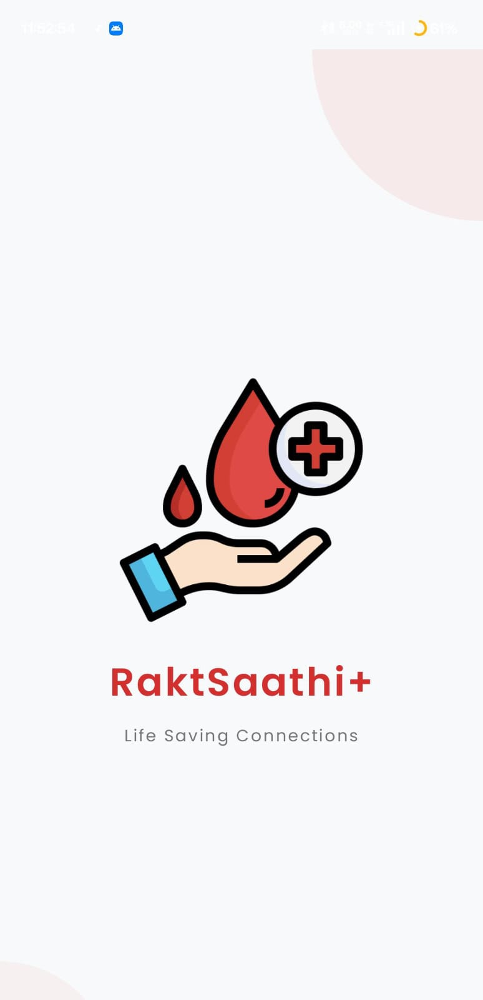
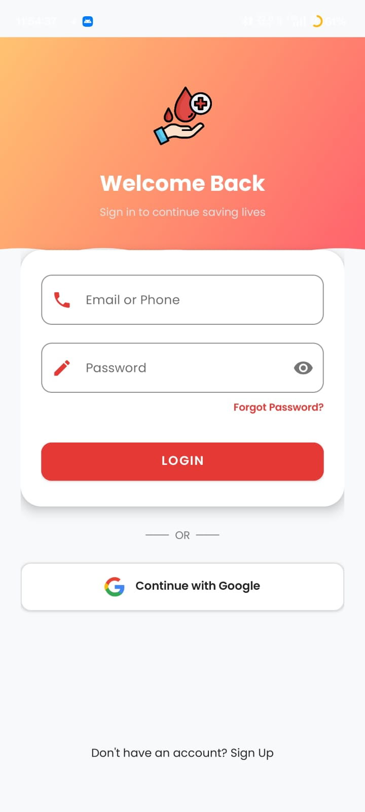

<h3>Home Dashboard</h3>
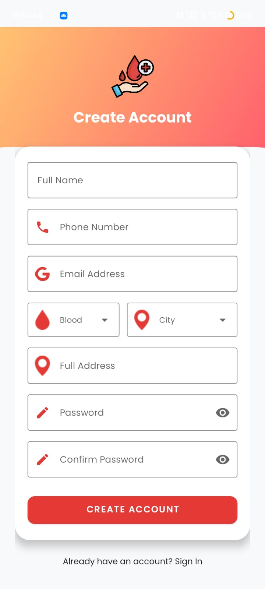
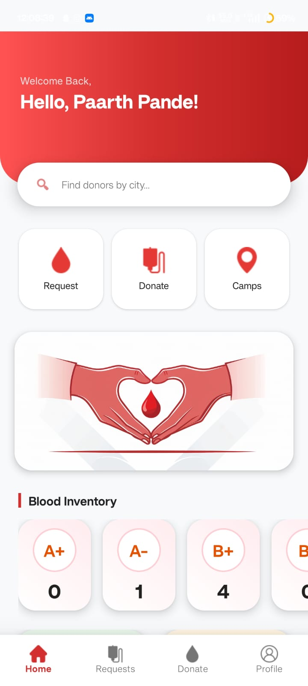
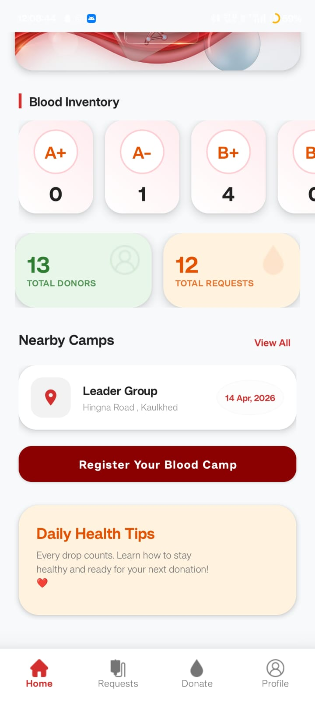

<h3>Blood Request Module</h3>
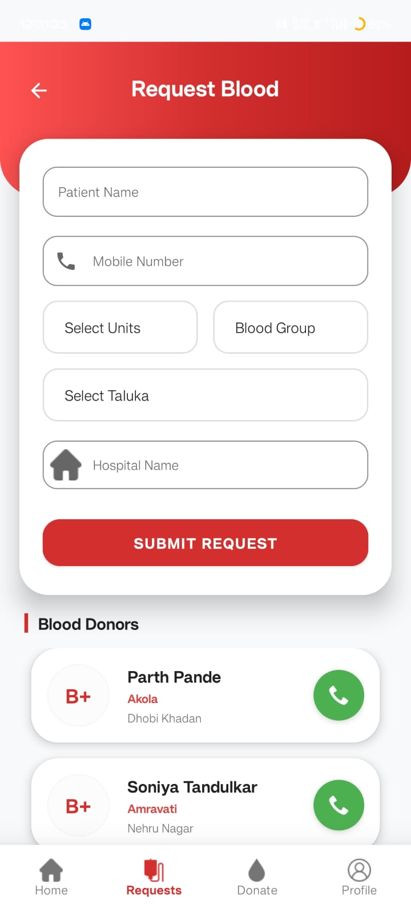
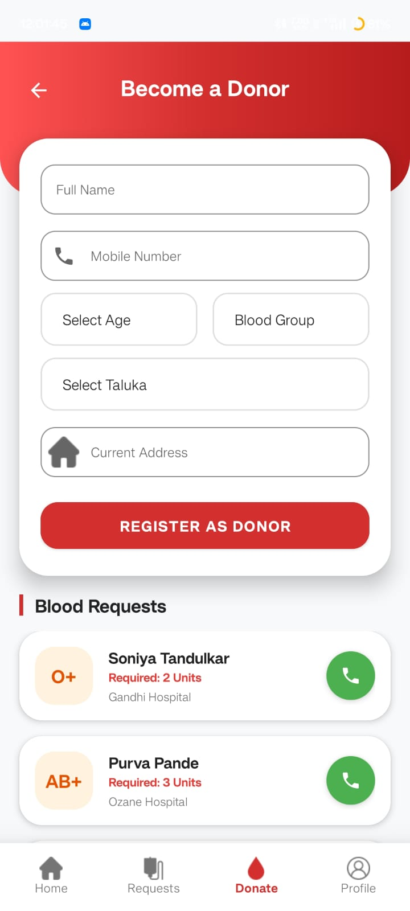

<h3>Donate Blood Module</h3>
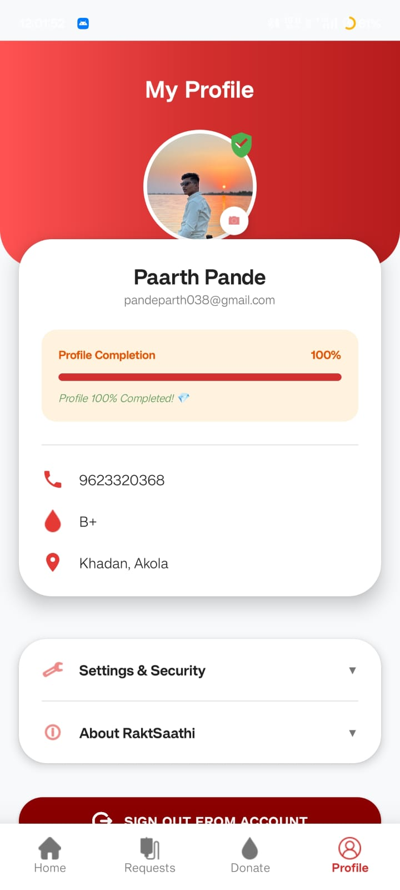
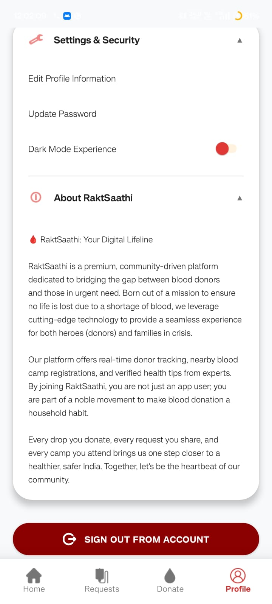

<h3>Profile Section</h3>
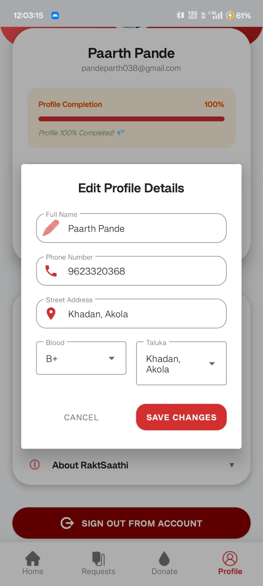
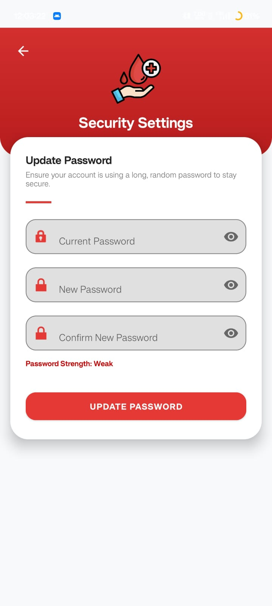

<h3>Additional Screens</h3>
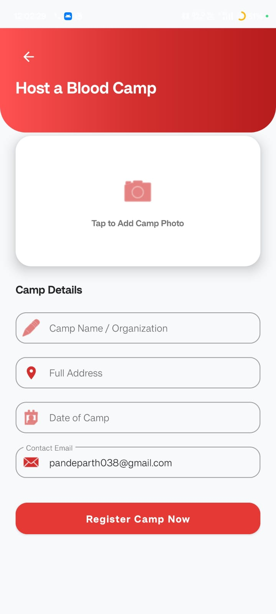
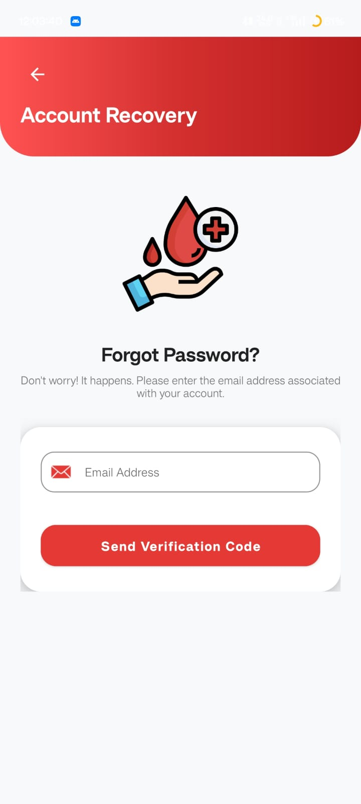
